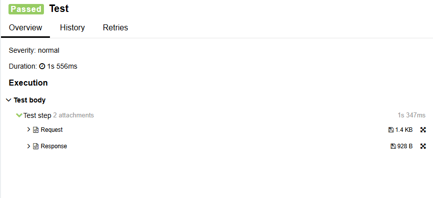

# Allure OpenFeign Decoder 🔍

[](https://docs.qameta.io/allure/)
[](LICENSE)
[](https://www.oracle.com/java/)
[](https://github.com/OpenFeign/feign)

Automatically captures Feign client HTTP traffic as Allure attachments for comprehensive API test reporting.

## ✨ Features
- **Automatic HTTP logging** of requests/responses
- **Seamless Allure integration** with templated attachments
- **Full traffic capture**: Headers, bodies, status codes

## 📦 Installation
```xml
<dependency>
    <groupId>io.github.sbushmelev</groupId>
    <artifactId>allure-open-feign</artifactId>
    <version>1.0</version>
    <scope>test</scope>
</dependency>
```

## 🚀 Usage (Example with GsonDecoder)
```java
       // Configure your Feign client
       MyClient myClient = Feign.builder()
                .decoder(new AllureResponseDecoder(new GsonDecoder()))
                .target(MyApi.class, "https://test.url");
```

## 📜 License
This project is licensed under the **Apache License 2.0**.  
See [LICENSE](LICENSE) for the full text.

Third-party library notices are in [NOTICE](NOTICE).

## 📊 Sample Report

